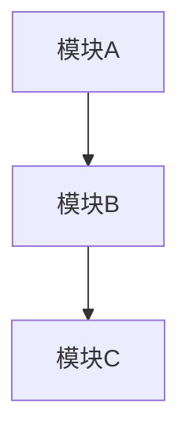

# 模块总体设计

## 1. 模块划分

### 1.1 核心模块 (core/)

- core/{模块1}
  * 职责：{职责和主要功能}
  * 包含：models(数据模型)、services(业务服务)、utils(工具函数)
  * 对外接口：{提供给其他模块的接口}
  * 依赖接口：{依赖其他模块的接口}
  * 数据流：{输入数据} -> {处理} -> {输出数据}
- core/{模块2}
  * 职责：{职责和主要功能}
  * 包含：models(数据模型)、services(业务服务)、utils(工具函数)
  * 对外接口：{提供给其他模块的接口}
  * 依赖接口：{依赖其他模块的接口}
  * 数据流：{输入数据} -> {处理} -> {输出数据}

### 1.2 UI模块 (ui/)

- ui/components/common：通用组件
  * 职责：{职责和主要功能}
  * 对外接口：{组件接口和事件}
  * 依赖接口：{依赖的服务和数据}
- ui/components/business：业务组件
  * 职责：{职责和主要功能}
  * 对外接口：{组件接口和事件}
  * 依赖接口：{依赖的服务和数据}
- ui/pages：页面视图和布局
  * 职责：{职责和主要功能}
  * 数据流：{用户交互} -> {数据处理} -> {界面更新}

### 1.3 业务模块 (modules/)

- modules/{模块1}
  * 职责：{职责和主要功能}
  * 包含：models(数据模型)、services(业务服务)、api(接口定义)
  * 对外接口：{提供给其他模块的接口}
  * 依赖接口：{依赖其他模块的接口}
  * 数据流：{输入数据} -> {处理} -> {输出数据}
- modules/{模块2}
  * 职责：{职责和主要功能}
  * 包含：models(数据模型)、services(业务服务)、api(接口定义)
  * 对外接口：{提供给其他模块的接口}
  * 依赖接口：{依赖其他模块的接口}
  * 数据流：{输入数据} -> {处理} -> {输出数据}

## 2. 模块依赖

## 3. 技术选型

| 模块     | 技术栈 | 说明   |
| -------- | ------ | ------ |
| {模块名} | {技术} | {原因} |

## 4. 模块间通信

| 源模块   | 目标模块   | 接口     | 数据流     | 通信方式    |
| -------- | ---------- | -------- | ---------- | ----------- |
| {源模块} | {目标模块} | {接口名} | {数据内容} | {同步/异步} |
